<p align="center">
    <picture>
        <source media="(prefers-color-scheme: dark)" srcset="art/banner-dark.svg">
        <source media="(prefers-color-scheme: light)" srcset="art/banner-light.svg">
        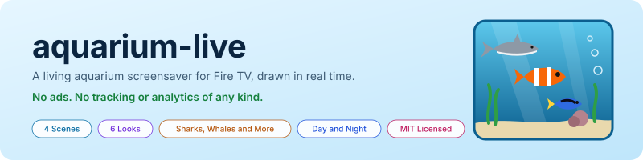
    </picture>
</p>

<p align="center">A living aquarium screensaver for Fire TV, Android TV and Google TV. Every fish, plant and coral is drawn by the app in real time: no video, no downloads, no ads, and no tracking or analytics of any kind.</p>

<p align="center">
    <a href="https://github.com/jeremykenedy/aquarium-live/releases/latest"></a>
    <a href="https://github.com/jeremykenedy/aquarium-live/releases"></a>
    <a href="https://github.com/jeremykenedy/aquarium-live/actions/workflows/tests.yml"></a>
    <a href="https://github.com/jeremykenedy/aquarium-live/actions/workflows/style.yml"></a>
    <a href="https://github.com/jeremykenedy/aquarium-live/actions/workflows/docs.yml"></a>
    <a href="https://github.com/jeremykenedy/aquarium-live/actions/workflows/security.yml"></a>
    <a href="https://dashboard.gitguardian.com/"></a>
    <a href="https://sonarcloud.io/summary/overall?id=jeremykenedy_aquarium-live&amp;branch=main"></a>
    <a href="https://sonarcloud.io/summary/new_code?id=jeremykenedy_aquarium-live"></a>
    <a href="https://sonarcloud.io/summary/overall?id=jeremykenedy_aquarium-live&amp;branch=main"></a>
    <a href="https://scrutinizer-ci.com/g/jeremykenedy/aquarium-live/build-status/main"></a>
    <a href="https://scrutinizer-ci.com/g/jeremykenedy/aquarium-live/?branch=main"></a>
    <a href="LICENSE"></a>
</p>

<p align="center">
    <a href="https://github.com/jeremykenedy"></a>
    <a href="https://github.com/jeremykenedy/aquarium-live" title="Open the repository and click Star"></a>
    <a href="https://github.com/sponsors/jeremykenedy" title="Sponsor jeremykenedy"></a>
</p>

<p align="center">
    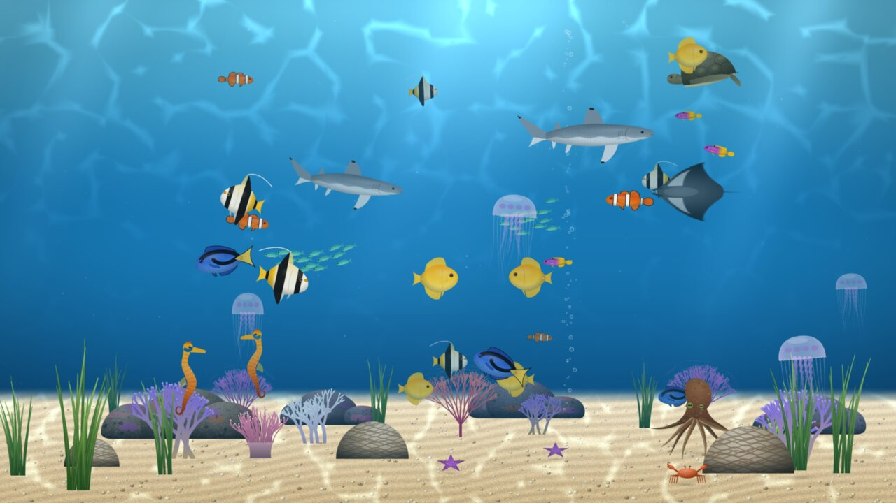
</p>

## Table of Contents

- [Quick start](#quick-start)
- [Features](#features)
- [Scenes](#scenes)
- [Looks](#looks)
- [Day and night](#day-and-night)
- [Settings](#settings)
- [Privacy](#privacy)
- [TV support](#tv-support)
- [Requirements](#requirements)
- [Installation](#installation)
- [Setting it as the screensaver](#setting-it-as-the-screensaver)
- [Updating](#updating)
- [Uninstalling](#uninstalling)
- [Troubleshooting](#troubleshooting)
- [How it works](#how-it-works)
- [Building from source](#building-from-source)
- [Testing](#testing)
- [Continuous integration](#continuous-integration)
- [Documentation](#documentation)
- [Changelog](#changelog)
- [License](#license)

## Quick start

With ADB debugging on, on a TV at `<tv-ip>`:

```bash
gh release download --repo jeremykenedy/aquarium-live --pattern 'aquarium-live.apk*'
shasum -a 256 -c aquarium-live.apk.sha256
adb connect <tv-ip>:5555
adb install -r aquarium-live.apk
adb shell settings put secure screensaver_components com.jeremykenedy.aquariumlive/.AquariumDream
```

Then open **Aquarium Live** on the TV to choose a scene and look. The full walkthrough, including how to put your old screensaver back, is in [Installation](docs/INSTALLATION.md).

## Features

- Four scenes: open ocean, coral reef, kelp forest and a planted fish tank.
- Six looks, from realistic to cartoon, a glossy 3D-movie look, a hand-painted classic look and a retro desktop screensaver look.
- Sharks, whales, dolphins, manta rays, sea turtles, octopuses, jellyfish, seahorses, crabs and starfish, each group switchable on or off.
- Fish counts from a few to a ton, plus schools that swim together and scatter around sharks and dolphins.
- Sunlight shimmer: shafts of light from the surface and rippling light on the sand.
- Day, evening and night lighting, or lighting that follows the clock.
- Random choices for every scene, look and content setting, or **Surprise me** to randomize them all each time it starts.
- An optional clock that drifts around the screen so it never sits in one spot.
- No permissions, no network access, no ads, no analytics.

## Scenes

| Scene | Fish | Sea life |
|-------|------|----------|
| Open ocean | Yellowfin tuna, barracuda, schools of sardines | Reef sharks, hammerheads, humpback whales, dolphins, manta rays, sea turtles, jellyfish, crabs, starfish |
| Coral reef | Clownfish, blue tangs, yellow tangs, royal grammas, Moorish idols, schools of chromis | Reef sharks, manta rays, sea turtles, octopuses, jellyfish, seahorses, crabs, starfish |
| Kelp forest | Garibaldi, kelp bass, schools of sardines | Leopard sharks, humpback whales, octopuses, jellyfish, seahorses, crabs, starfish |
| Fish tank | Angelfish, discus, bettas, dwarf gouramis, schools of neon tetras and rummy-nose tetras | None. It is a home aquarium. |

Whales don't stay: one swims through every so often, far in the background, then leaves.

<p align="center">
    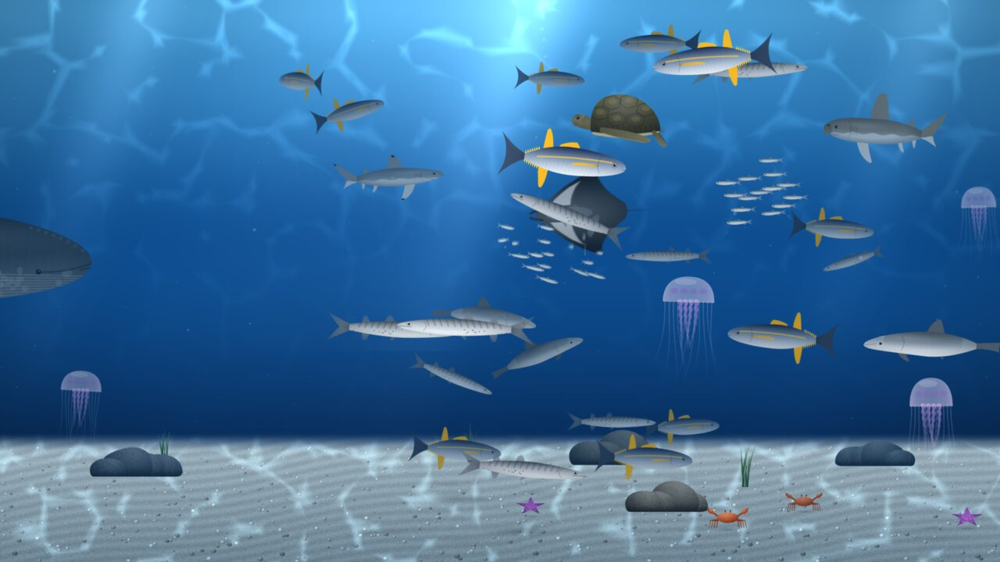
    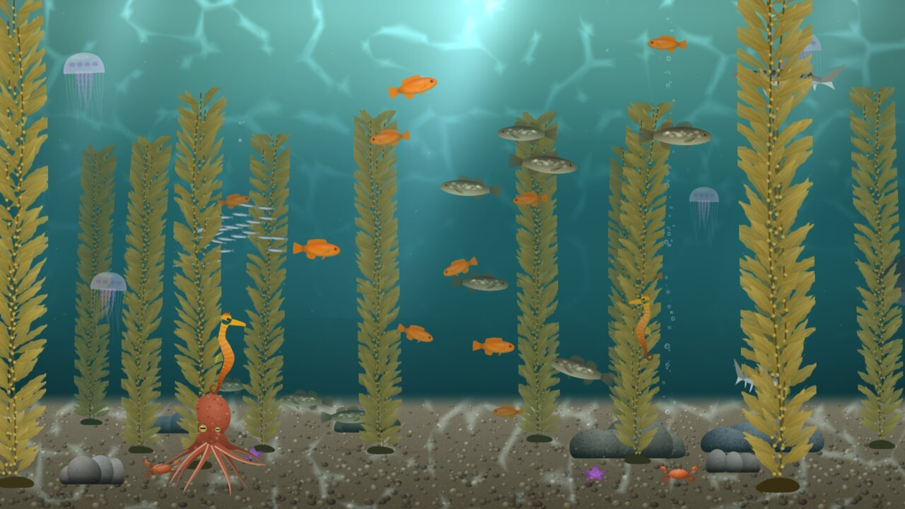
    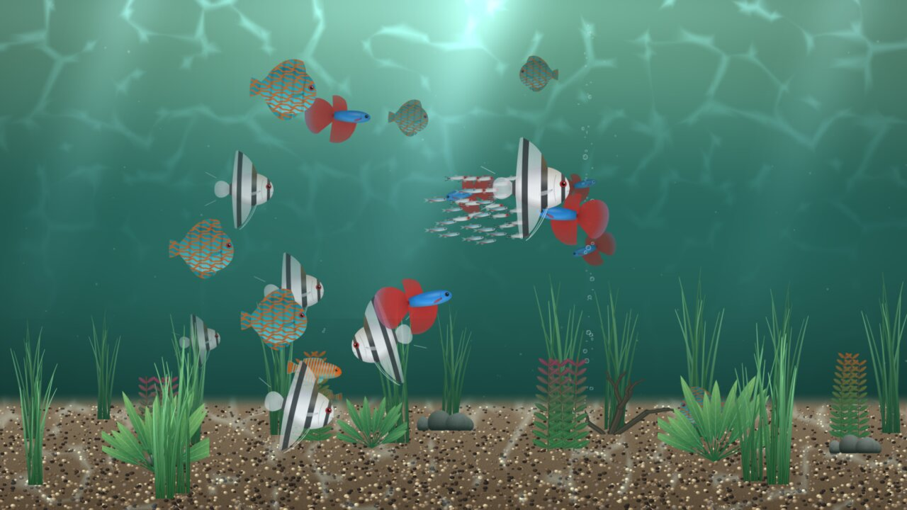
    
</p>

## Looks

| Look | What it does |
|------|--------------|
| Realistic | Soft shading, fine scales and fin rays, slightly muted colour. The default. |
| Animated | Brighter colour, big expressive eyes, no fine detail. |
| Cartoon | Bold ink outlines, flat bands of colour, big friendly eyes. |
| 3D movie | Glossy highlights, rim light, large glossy eyes, saturated colour. |
| Hand-painted classic | Thin painted outlines, soft cel shading, a teal painted sea. |
| Retro screensaver | Chunky low-resolution pixels, a limited palette and a deep blue sea, like an old desktop screensaver. |

<p align="center">
    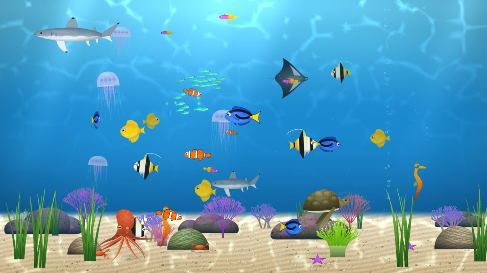
    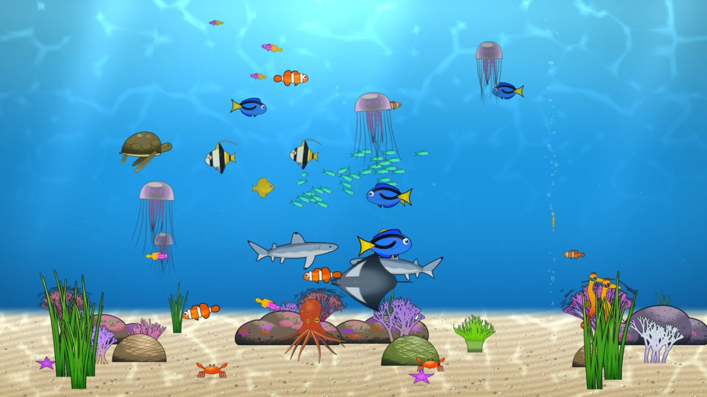
    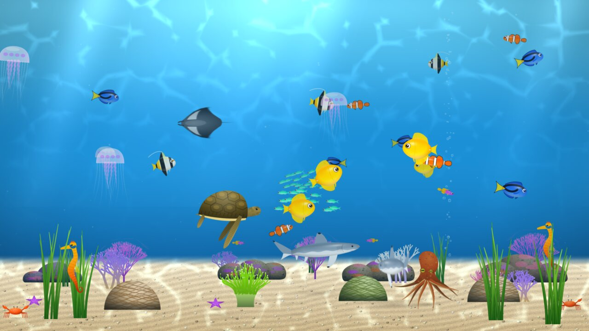
    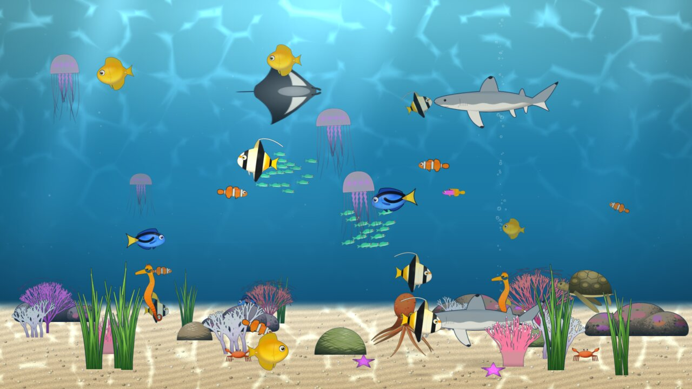
    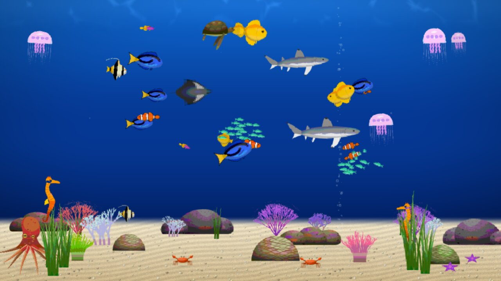
    
</p>

## Day and night

**Day or night** sets how bright the water is. Day is bright, Evening is warm, and Night is a dim moonlit blue that is easy on the eyes in a dark room. Follow the clock moves between them through the day: full daylight from 8:00 to 17:00, fading to evening by 19:00 and to night by 21:00, night until 6:00, then brightening back to day by 8:00. Sunlight shimmer fades to moonlight as it gets darker. **Brightness** dims everything further.

<p align="center">
    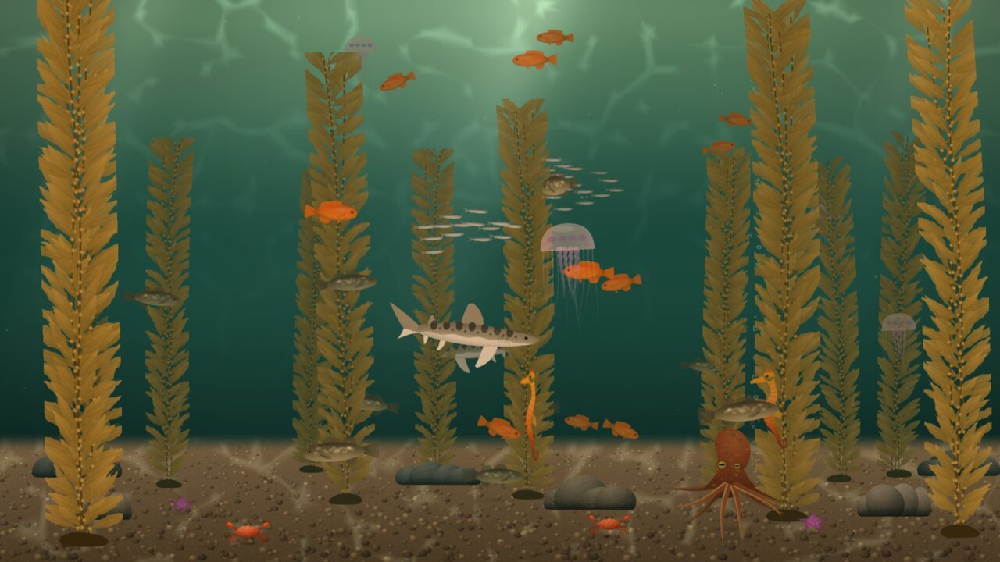
    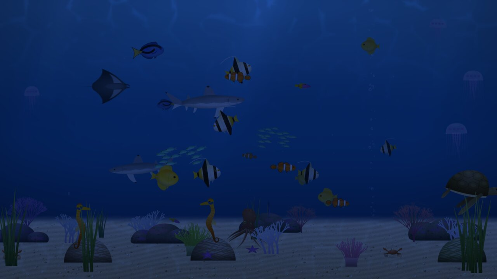
</p>

## Settings

Open **Aquarium Live** from the apps on your TV, or run `adb shell am start -n com.jeremykenedy.aquariumlive/.SettingsActivity`. Every setting applies the next time the screensaver starts; **Preview** shows it straight away. Each setting is explained in [Configuration](docs/CONFIGURATION.md).

<p align="center">
    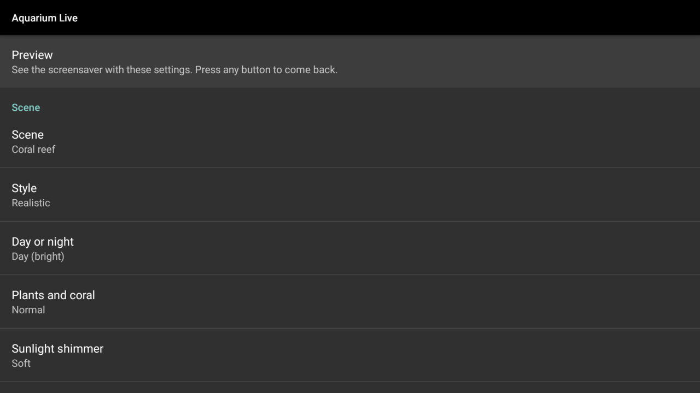
</p>

| Setting | Choices | Default |
|---------|---------|---------|
| Surprise me | On, Off | Off |
| Scene | Open ocean, Coral reef, Kelp forest, Fish tank, Random | Coral reef |
| Style | Realistic, Animated, Cartoon, 3D movie, Hand-painted classic, Retro screensaver, Random | Realistic |
| Day or night | Day (bright), Evening (warm), Night (dim), Follow the clock, Random | Day (bright) |
| Plants and coral | Sparse, Normal, Lush, Random | Normal |
| Sunlight shimmer | Off, Soft, Bright, Random | Soft |
| Bubbles | Off, Airstone, Airstone and fish bubbles, Random | Airstone and fish bubbles |
| Floating specks | On, Off, Random | On |
| Fish | A few (6), A handful (12), A bunch (20), A lot (30), A ton (45), Random | A bunch |
| Schools | None, One school, A few schools, Huge schools, Random | A few schools |
| Swimming speed | Calm, Normal, Lively, Random | Normal |
| Which sea life | Sharks, Whales, Dolphins, Manta rays, Sea turtles, Octopuses, Jellyfish, Seahorses, Crabs and starfish, A random mix each time | All except the random mix |
| How much sea life | None, A little, Some, Lots, Random | Some |
| Brightness | Full, 80%, 60%, 40% | Full |
| Resolution | Automatic (recommended), 4K (2160p), 1440p, 1080p | Automatic |
| Frame rate | Automatic (recommended), 60, 30 | Automatic |
| Show the time | On, Off | Off |

### Random

Every scene, look and content setting has a **Random** choice, picked again each time the screensaver starts. Set just the ones you want to change from night to night and keep the rest fixed: for example a fixed coral reef with a random look, or a fixed look with a random scene. **Random** lighting picks day, evening or night. **A random mix each time** under Which sea life gives every group an even chance of showing up, and always at least one.

**Surprise me** randomizes all of them at once, without changing their saved choices: while it is on they are greyed out, and turning it off brings them back as they were. Brightness, resolution, frame rate and the clock are never randomized, so the screensaver never surprises you with a brighter screen or a slower frame rate.

Schools come on top of the fish count: one school is 14 fish, a few schools are 14 and 18, and huge schools are 28, 26 and 24. Each scene only shows the sea life that lives there.

## Privacy

Aquarium Live requests no Android permissions at all, not even internet access, so it cannot send or receive anything. It has no ads, no analytics, no crash reporting and no third-party libraries: the app is built from its own source and the Android framework, nothing else. Settings stay on the TV.

You can check the permissions yourself on any build:

```bash
aapt dump permissions aquarium-live.apk
```

The output lists the package name and no `uses-permission` lines. The CI build fails if a permission ever appears.

## TV support

The same APK works on Fire TV, Android TV and Google TV. It uses only the Android framework, has a TV launcher entry, and is a standard Android screensaver (a `DreamService`), so it needs Android 5.1 (API 22) or newer and OpenGL ES 2.0, and nothing from Amazon or Google.

Tested on:

| Device | Android | Checked |
|--------|---------|---------|
| Fire TV Edition TV (AFTDEC012E) | 11 (API 30) | Settings, preview, every scene and look, screensaver started and woken from the remote |
| Google TV emulator | 14 (API 34) | Install, launcher entry, settings with the remote, Surprise me and Random, preview, screensaver started on its own after the idle timeout |
| Android TV emulator | 12 (API 31) | Install, launcher entry, screensaver started on its own after the idle timeout |
| Android emulator | 5.1.1 (API 22) | Install, settings, preview at a fixed 1080p resolution, screensaver started |

Physical Android TV and Google TV devices have not been tested yet.

## Requirements

- A Fire TV, Android TV or Google TV with ADB debugging turned on in its developer options. For a Fire TV, the steps with screenshots are in [Putting your Fire TV in developer mode](https://github.com/jeremykenedy/amazon-fire-tv-fixes#putting-your-fire-tv-in-developer-mode).
- [adb](https://developer.android.com/tools/adb) on a computer on the same network
- To build from source: a JDK (CI runs 17 and 21) and the Android SDK build tools

## Installation

1. Download `aquarium-live.apk` and `aquarium-live.apk.sha256` from the [latest release](https://github.com/jeremykenedy/aquarium-live/releases/latest) and check the APK. It should print `aquarium-live.apk: OK`:

    ```bash
    shasum -a 256 -c aquarium-live.apk.sha256
    ```

2. Connect to the TV over the network, using your TV's IP address:

    ```bash
    adb connect <tv-ip>:5555
    ```

3. Install the APK:

    ```bash
    adb install aquarium-live.apk
    ```

4. Open **Aquarium Live** to choose your settings and preview them.

## Setting it as the screensaver

First note the screensaver the TV uses now, so you can put it back later:

```bash
adb shell settings get secure screensaver_components
```

Then set Aquarium Live as the screensaver over adb. This works the same way on Fire TV, Android TV and Google TV:

```bash
adb shell settings put secure screensaver_components com.jeremykenedy.aquariumlive/.AquariumDream
```

To see it right away instead of waiting for the TV to go idle (this worked on the Fire TV and on Android 5.1; on the Google TV 14 emulator the screensaver started once the TV had been idle instead):

```bash
adb shell am start -n com.android.systemui/.Somnambulator
```

Press any button on the remote to wake the TV.

## Updating

Download the new release, check its checksum, and install it over the old one with `adb install -r aquarium-live.apk`. Your settings are kept. Releases are always signed with the same key; an APK you build and sign yourself cannot update a released install (`INSTALL_FAILED_UPDATE_INCOMPATIBLE`) until the released one is uninstalled.

## Uninstalling

Put the screensaver you noted during setup back first, then remove the app:

```bash
adb shell settings put secure screensaver_components <the value you noted>
adb uninstall com.jeremykenedy.aquariumlive
```

The stock values on the devices this was tested on:

| Device | Stock screensaver |
|--------|-------------------|
| Fire TV | `com.amazon.ftv.screensaver/.app.services.ScreensaverService` |
| Google TV 14 emulator | `com.google.android.apps.tv.dreamx/.service.Backdrop` |
| Android TV 12 emulator | `com.google.android.backdrop/.Backdrop` |

## Troubleshooting

- **The screensaver never starts:** check `adb shell settings get secure screensaver_components` prints `com.jeremykenedy.aquariumlive/.AquariumDream`, and that `adb shell settings get global stay_on_while_plugged_in` is `0`; when it is not, the TV never goes idle.
- **It takes a few seconds to appear the first time:** the art is painted on the TV and then saved, so later starts are quicker.
- **A setting is greyed out:** Surprise me is on and is choosing it.
- **It does not look 4K:** see [Resolution](docs/ARCHITECTURE.md#resolution).

More in [Troubleshooting](docs/TROUBLESHOOTING.md).

## How it works

- **Drawn in real time.** Each fish, coral, plant and creature is painted by the app when it starts, from shapes described in code, then animated on the GPU with OpenGL ES. Fish bend their tails as they swim, whales and dolphins kick their flukes, manta rays flap, turtles row with their flippers, octopuses curl their arms and jellyfish pulse.
- **Behaviour.** Fish wander, rest and turn around, schools hold together and move as one, small fish keep clear of sharks and dolphins, crabs scuttle, octopuses crawl and sometimes swim, seahorses hover near plants, and whales pass through from time to time.
- **Fast start.** The painted art is saved on the TV after the first run, so later starts load it instead of painting it again. The water appears at once and each creature fades in as its art is ready.
- **Resolution.** On the Fire TV Edition TV this was built on (model AFTDEC012E), apps draw on a 1920x1080 graphics layer that the TV scales up to its 4K panel; only video playback reaches the panel at full 4K. Automatic resolution draws at the size the TV actually shows, which keeps motion smooth. Higher resolutions are in the settings for TVs that compose apps at 4K.
- **Frame rate.** Automatic starts at 60 frames per second and settles on a steady 30 if the TV cannot keep up, because even 30 looks smoother than a rate that keeps changing. On the AFTDEC012E the default scene runs at a steady 30.

The details, file by file, are in [Architecture](docs/ARCHITECTURE.md).

## Building from source

```bash
./build.sh
```

This builds and signs `build/aquarium-live.apk` with only the JDK and the Android SDK build tools. There is no Gradle. The first build creates a signing key in `~/.android/aquarium-live.jks`; keep it backed up, because the TV only accepts updates signed with the same key. `DEBUG=1 ./build.sh` makes a debuggable build for testing on a device. See [Building](docs/BUILDING.md) for the requirements and each step, and [Releasing](docs/RELEASING.md) for publishing a release.

## Testing

```bash
./test.sh
```

Runs the plain-JVM tests for the simulation, the settings parsing and the shading maths: fish counts and schools for every scene and setting, sea-life toggles, everything staying inside the tank over 20 simulated minutes, whales coming and going, schools holding together, and fish turning around. `./coverage.sh` runs the same tests under JaCoCo and writes `build/jacoco.xml`. Every class that can run on a plain JVM has 100% line and branch coverage. The painting, the renderer and the Android components need a device, so they are checked on devices and left out of the coverage measure; see [Testing](docs/TESTING.md) for what is covered and how each device was checked.

## Continuous integration

Every push to `main` and every pull request runs six workflows: the tests on Java 17 and 21 and an APK build that fails if it requests any permission; code style; the documentation checks; a security check of the manifest and a gitleaks secret scan of the files and history; a GitGuardian scan; and a SonarCloud analysis with coverage. Scrutinizer builds and analyzes each push once the repository is added on scrutinizer-ci.com. See [CI](docs/CI.md) for what each one checks and the secrets they need.

## Documentation

| Guide | Covers |
|-------|--------|
| [Installation](docs/INSTALLATION.md) | Downloading and checking a release, installing, setting the screensaver, updating, uninstalling |
| [Configuration](docs/CONFIGURATION.md) | Every setting, Random and Surprise me, sea-life numbers, recipes |
| [Troubleshooting](docs/TROUBLESHOOTING.md) | When it does not start, install errors, smoothness, brightness |
| [Architecture](docs/ARCHITECTURE.md) | How the simulation, art, rendering and frame pacing work |
| [Building](docs/BUILDING.md) | Building and signing the APK without Gradle |
| [Testing](docs/TESTING.md) | The automated tests, coverage and device testing |
| [Releasing](docs/RELEASING.md) | Publishing a release with its checksum |
| [CI](docs/CI.md) | The GitHub Actions workflows and their secrets |

## Changelog

See [CHANGELOG.md](CHANGELOG.md).

## License

Aquarium Live is open-sourced software licensed under the [MIT license](LICENSE).
