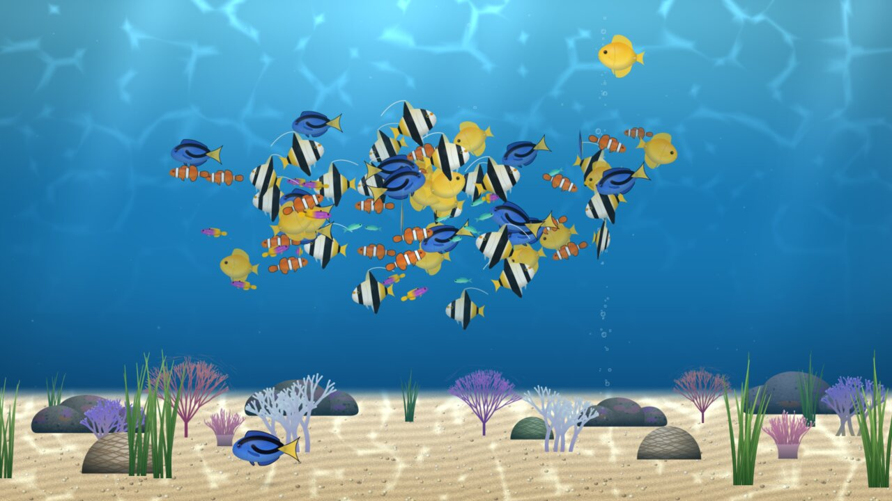
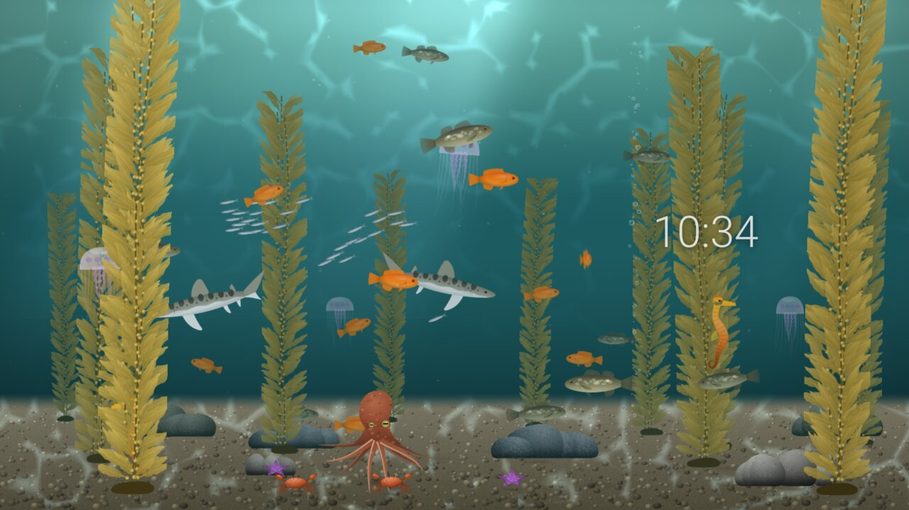
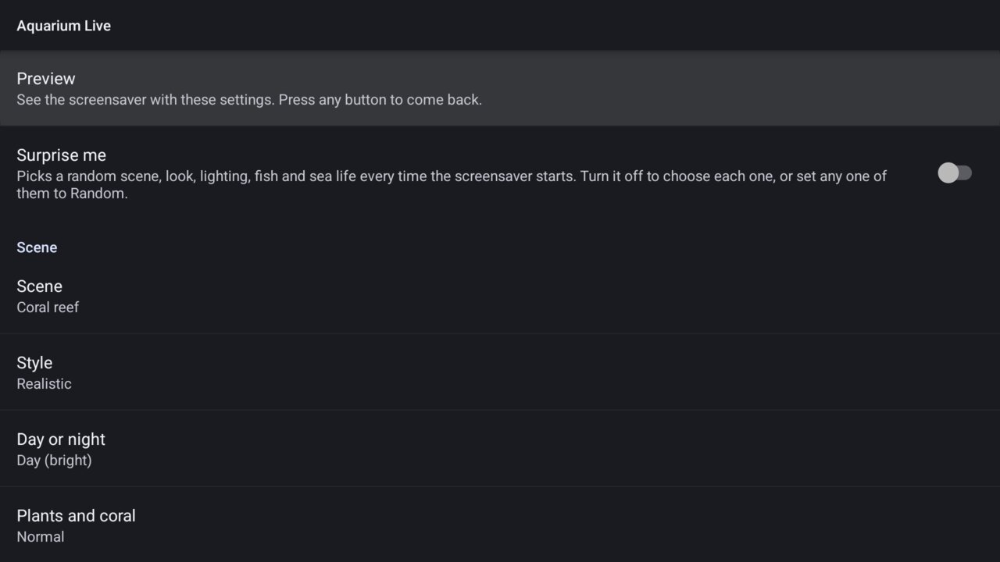
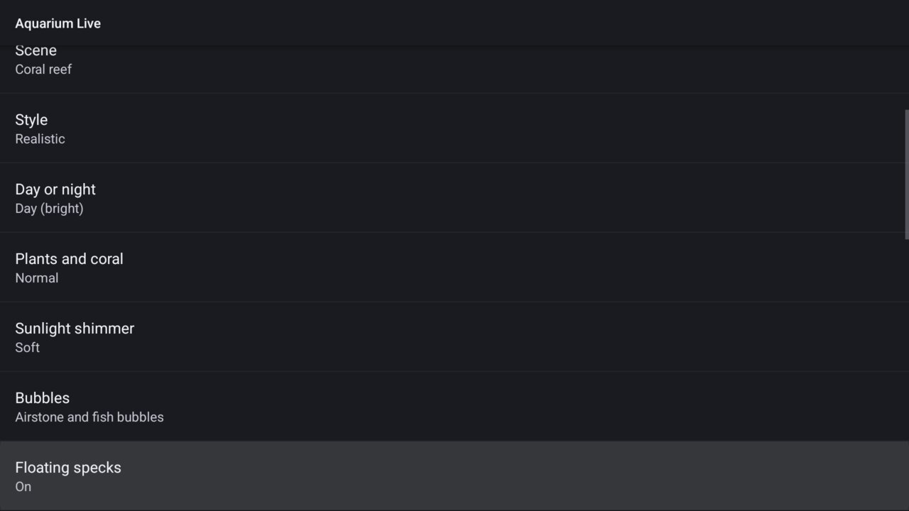
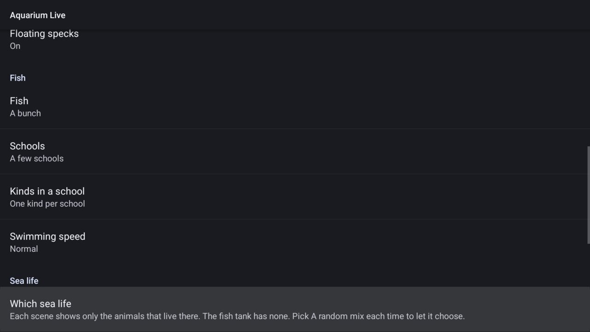
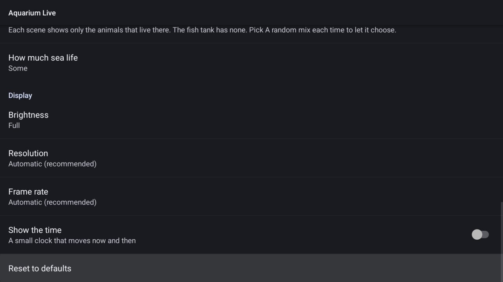
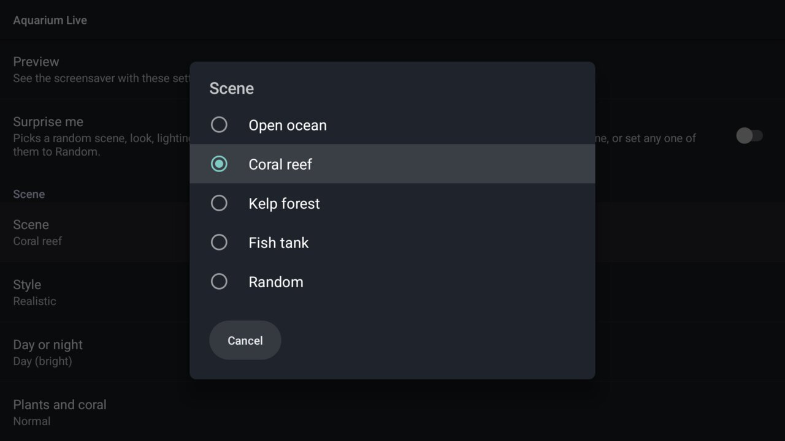
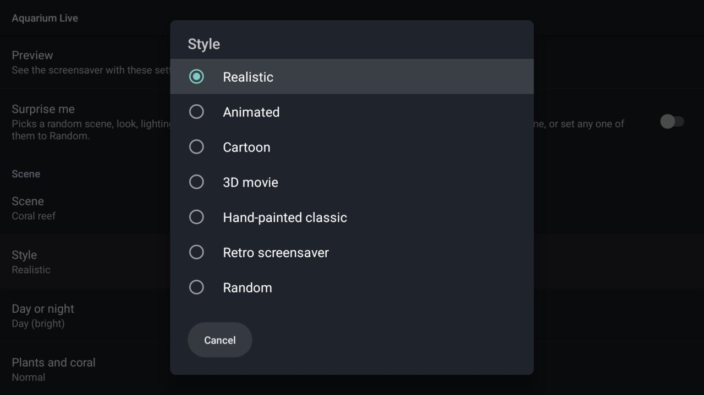
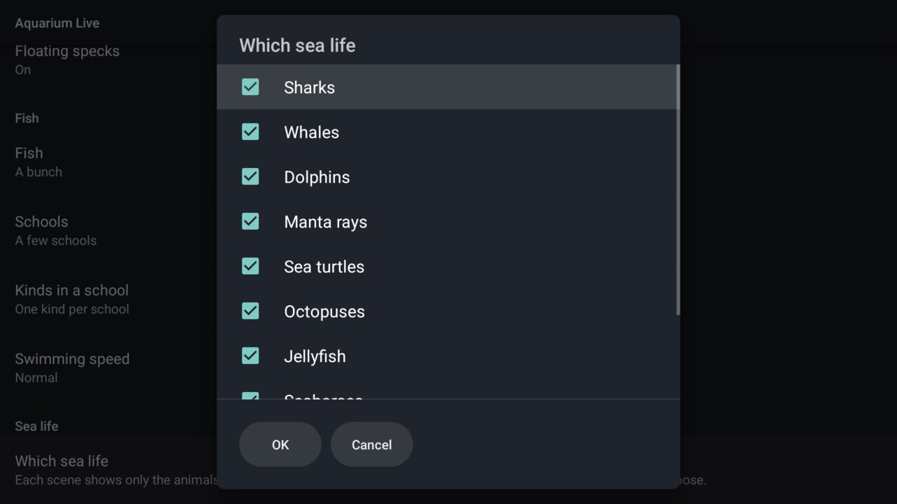
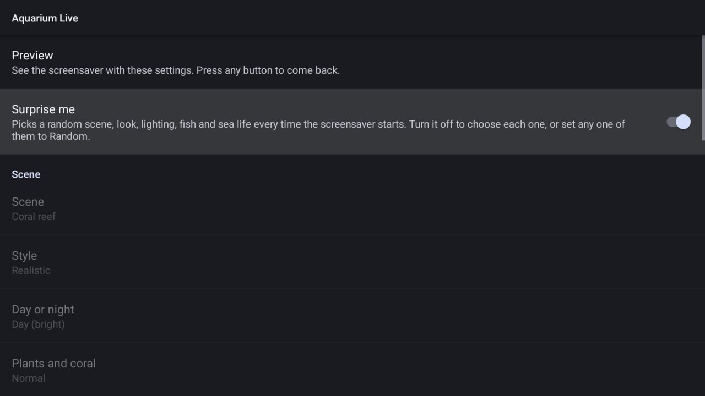

<p align="center">
    <picture>
        <source media="(prefers-color-scheme: dark)" srcset="art/banner-dark.svg">
        <source media="(prefers-color-scheme: light)" srcset="art/banner-light.svg">
        
    </picture>
</p>

<p align="center">A living aquarium screensaver for Fire TV, Android TV and Google TV. Every fish, plant and coral is drawn by the app in real time: no video, no downloads, no ads, and no tracking or analytics of any kind.</p>

<p align="center">
    <a href="https://github.com/jeremykenedy/aquarium-live/releases/latest"></a>
    <a href="https://github.com/jeremykenedy/aquarium-live/releases"></a>
    <a href="https://github.com/jeremykenedy/aquarium-live/actions/workflows/tests.yml"></a>
    <a href="https://github.com/jeremykenedy/aquarium-live/actions/workflows/style.yml"></a>
    <a href="https://github.com/jeremykenedy/aquarium-live/actions/workflows/docs.yml"></a>
    <a href="https://github.com/jeremykenedy/aquarium-live/actions/workflows/security.yml"></a>
    <a href="https://dashboard.gitguardian.com/"></a>
    <a href="https://sonarcloud.io/summary/overall?id=jeremykenedy_aquarium-live&amp;branch=main"></a>
    <a href="https://sonarcloud.io/summary/new_code?id=jeremykenedy_aquarium-live"></a>
    <a href="https://sonarcloud.io/summary/overall?id=jeremykenedy_aquarium-live&amp;branch=main"></a>
    <a href="https://www.codefactor.io/repository/github/jeremykenedy/aquarium-live"></a>
    <a href="https://app.codacy.com/gh/jeremykenedy/aquarium-live/dashboard"></a>
    <a href="LICENSE"></a>
</p>

<p align="center">
    <a href="https://app.aikido.dev/repositories/3326671"></a>
</p>

<p align="center">
    <a href="https://github.com/jeremykenedy"></a>
    <a href="https://github.com/jeremykenedy/aquarium-live" title="Open the repository and click Star"></a>
    <a href="https://github.com/jeremykenedy/aquarium-live/stargazers"></a>
    <a href="https://github.com/sponsors/jeremykenedy" title="Sponsor jeremykenedy"></a>
</p>

## Table of Contents

- [Features](#features)
- [What it does](#what-it-does)
- [Screenshots](#screenshots)
- [Scenes](#scenes)
- [Looks](#looks)
- [Day and night](#day-and-night)
- [Platform support](#platform-support)
- [Requirements](#requirements)
- [Integrations](#integrations)
- [Installation](#installation)
- [Setting it as the screensaver](#setting-it-as-the-screensaver)
- [Upgrading](#upgrading)
- [Configuration](#configuration)
- [Uninstalling](#uninstalling)
- [Privacy](#privacy)
- [Troubleshooting](#troubleshooting)
- [How it works](#how-it-works)
- [File tree](#file-tree)
- [Building from source](#building-from-source)
- [Testing](#testing)
- [Continuous integration](#continuous-integration)
- [Documentation](#documentation)
- [Changelog](#changelog)
- [License](#license)

## Features

- **Four scenes:** open ocean, coral reef, kelp forest and a planted fish tank, each with its own fish, plants and sea life.
- **Six looks:** realistic, animated, cartoon, a glossy 3D movie look, a hand-painted classic look and a retro desktop screensaver look.
- **Sea life:** sharks, whales, dolphins, manta rays, sea turtles, octopuses, jellyfish, seahorses, crabs and starfish, each group on or off, in four amounts.
- **Fish and schools:** from a few fish to a ton, plus schools that hold together and scatter around sharks and dolphins, either one kind per school or different kinds mixed together.
- **Day and night:** day, evening and night lighting, or lighting that follows the clock, with a brightness setting on top.
- **Sunlight:** shafts of light from the surface and rippling light on the sand, soft, bright or off.
- **Random and Surprise me:** a Random choice for every scene, look and content setting, or Surprise me to pick them all each time it starts.
- **Clock:** an optional clock that fades to a new spot every 45 seconds so it never burns in.
- **Private:** no permissions, no network access, no ads, no analytics and no third-party code.
- **Any Android TV:** the same APK runs on Fire TV, Android TV and Google TV, Android 5.1 and newer.

## What it does

Aquarium Live is an Android screensaver. When the TV goes idle, Android starts it and it fills the screen with a living aquarium until you press a button on the remote. Nothing is a video: every fish, plant, coral and creature is painted by the app on the TV and animated in real time, so no two minutes look the same. The settings screen, opened from the apps on the TV, chooses what is in the water and how it looks, and **Preview** shows the result at once.

## Screenshots

The scenes, looks and lighting were captured on a Fire TV. The settings screens and the mixed schools and clock were captured on the Google TV 14 emulator. Select any screenshot to open it full size.

### Scenes

<p align="center">
    <a href="docs/screenshots/coral-reef-realistic.jpg"><picture><source media="(min-width: 1280px)" srcset="docs/screenshots/grid/coral-reef-realistic-desktop.jpg 2x"><source media="(min-width: 600px)" srcset="docs/screenshots/grid/coral-reef-realistic-tablet.jpg 2x"></picture></a>
    <a href="docs/screenshots/open-ocean.jpg"><picture><source media="(min-width: 1280px)" srcset="docs/screenshots/grid/open-ocean-desktop.jpg 2x"><source media="(min-width: 600px)" srcset="docs/screenshots/grid/open-ocean-tablet.jpg 2x"></picture></a>
    <a href="docs/screenshots/kelp-forest.jpg"><picture><source media="(min-width: 1280px)" srcset="docs/screenshots/grid/kelp-forest-desktop.jpg 2x"><source media="(min-width: 600px)" srcset="docs/screenshots/grid/kelp-forest-tablet.jpg 2x"></picture></a>
    <a href="docs/screenshots/fish-tank.jpg"><picture><source media="(min-width: 1280px)" srcset="docs/screenshots/grid/fish-tank-desktop.jpg 2x"><source media="(min-width: 600px)" srcset="docs/screenshots/grid/fish-tank-tablet.jpg 2x"></picture></a>
</p>

### Looks

<p align="center">
    <a href="docs/screenshots/coral-reef-realistic.jpg"><picture><source media="(min-width: 1280px)" srcset="docs/screenshots/grid/coral-reef-realistic-desktop.jpg 2x"><source media="(min-width: 600px)" srcset="docs/screenshots/grid/coral-reef-realistic-tablet.jpg 2x"></picture></a>
    <a href="docs/screenshots/look-animated.jpg"><picture><source media="(min-width: 1280px)" srcset="docs/screenshots/grid/look-animated-desktop.jpg 2x"><source media="(min-width: 600px)" srcset="docs/screenshots/grid/look-animated-tablet.jpg 2x"></picture></a>
    <a href="docs/screenshots/look-cartoon.jpg"><picture><source media="(min-width: 1280px)" srcset="docs/screenshots/grid/look-cartoon-desktop.jpg 2x"><source media="(min-width: 600px)" srcset="docs/screenshots/grid/look-cartoon-tablet.jpg 2x"></picture></a>
    <a href="docs/screenshots/look-3d-movie.jpg"><picture><source media="(min-width: 1280px)" srcset="docs/screenshots/grid/look-3d-movie-desktop.jpg 2x"><source media="(min-width: 600px)" srcset="docs/screenshots/grid/look-3d-movie-tablet.jpg 2x"></picture></a>
    <a href="docs/screenshots/look-hand-painted.jpg"><picture><source media="(min-width: 1280px)" srcset="docs/screenshots/grid/look-hand-painted-desktop.jpg 2x"><source media="(min-width: 600px)" srcset="docs/screenshots/grid/look-hand-painted-tablet.jpg 2x"></picture></a>
    <a href="docs/screenshots/look-retro.jpg"><picture><source media="(min-width: 1280px)" srcset="docs/screenshots/grid/look-retro-desktop.jpg 2x"><source media="(min-width: 600px)" srcset="docs/screenshots/grid/look-retro-tablet.jpg 2x"></picture></a>
</p>

### Lighting, schools and the clock

<p align="center">
    <a href="docs/screenshots/evening.jpg"><picture><source media="(min-width: 1280px)" srcset="docs/screenshots/grid/evening-desktop.jpg 2x"><source media="(min-width: 600px)" srcset="docs/screenshots/grid/evening-tablet.jpg 2x"></picture></a>
    <a href="docs/screenshots/night.jpg"><picture><source media="(min-width: 1280px)" srcset="docs/screenshots/grid/night-desktop.jpg 2x"><source media="(min-width: 600px)" srcset="docs/screenshots/grid/night-tablet.jpg 2x"></picture></a>
    <a href="docs/screenshots/mixed-schools.jpg"><picture><source media="(min-width: 1280px)" srcset="docs/screenshots/grid/mixed-schools-desktop.jpg 2x"><source media="(min-width: 600px)" srcset="docs/screenshots/grid/mixed-schools-tablet.jpg 2x"></picture></a>
    <a href="docs/screenshots/clock.jpg"><picture><source media="(min-width: 1280px)" srcset="docs/screenshots/grid/clock-desktop.jpg 2x"><source media="(min-width: 600px)" srcset="docs/screenshots/grid/clock-tablet.jpg 2x"></picture></a>
</p>

### Settings

<p align="center">
    <a href="docs/screenshots/settings-top.jpg"><picture><source media="(min-width: 1280px)" srcset="docs/screenshots/grid/settings-top-desktop.jpg 2x"><source media="(min-width: 600px)" srcset="docs/screenshots/grid/settings-top-tablet.jpg 2x"></picture></a>
    <a href="docs/screenshots/settings-scene.jpg"><picture><source media="(min-width: 1280px)" srcset="docs/screenshots/grid/settings-scene-desktop.jpg 2x"><source media="(min-width: 600px)" srcset="docs/screenshots/grid/settings-scene-tablet.jpg 2x"></picture></a>
    <a href="docs/screenshots/settings-fish.jpg"><picture><source media="(min-width: 1280px)" srcset="docs/screenshots/grid/settings-fish-desktop.jpg 2x"><source media="(min-width: 600px)" srcset="docs/screenshots/grid/settings-fish-tablet.jpg 2x"></picture></a>
    <a href="docs/screenshots/settings-display.jpg"><picture><source media="(min-width: 1280px)" srcset="docs/screenshots/grid/settings-display-desktop.jpg 2x"><source media="(min-width: 600px)" srcset="docs/screenshots/grid/settings-display-tablet.jpg 2x"></picture></a>
    <a href="docs/screenshots/choice-scene.jpg"><picture><source media="(min-width: 1280px)" srcset="docs/screenshots/grid/choice-scene-desktop.jpg 2x"><source media="(min-width: 600px)" srcset="docs/screenshots/grid/choice-scene-tablet.jpg 2x"></picture></a>
    <a href="docs/screenshots/choice-style.jpg"><picture><source media="(min-width: 1280px)" srcset="docs/screenshots/grid/choice-style-desktop.jpg 2x"><source media="(min-width: 600px)" srcset="docs/screenshots/grid/choice-style-tablet.jpg 2x"></picture></a>
    <a href="docs/screenshots/choice-sea-life.jpg"><picture><source media="(min-width: 1280px)" srcset="docs/screenshots/grid/choice-sea-life-desktop.jpg 2x"><source media="(min-width: 600px)" srcset="docs/screenshots/grid/choice-sea-life-tablet.jpg 2x"></picture></a>
    <a href="docs/screenshots/surprise-me.jpg"><picture><source media="(min-width: 1280px)" srcset="docs/screenshots/grid/surprise-me-desktop.jpg 2x"><source media="(min-width: 600px)" srcset="docs/screenshots/grid/surprise-me-tablet.jpg 2x"></picture></a>
</p>

## Scenes

| Scene | Fish | Sea life |
|-------|------|----------|
| Open ocean | Yellowfin tuna, barracuda, schools of sardines | Reef sharks, hammerheads, humpback whales, dolphins, manta rays, sea turtles, jellyfish, crabs, starfish |
| Coral reef | Clownfish, blue tangs, yellow tangs, royal grammas, Moorish idols, schools of chromis | Reef sharks, manta rays, sea turtles, octopuses, jellyfish, seahorses, crabs, starfish |
| Kelp forest | Garibaldi, kelp bass, schools of sardines | Leopard sharks, humpback whales, octopuses, jellyfish, seahorses, crabs, starfish |
| Fish tank | Angelfish, discus, bettas, dwarf gouramis, schools of neon tetras and rummy-nose tetras | None. It is a home aquarium. |

Whales don't stay: one swims through every so often, far in the background, then leaves.

## Looks

| Look | What it does |
|------|--------------|
| Realistic | Soft shading, fine scales and fin rays, slightly muted colour. The default. |
| Animated | Brighter colour, big expressive eyes, no fine detail. |
| Cartoon | Bold ink outlines, flat bands of colour, big friendly eyes. |
| 3D movie | Glossy highlights, rim light, large glossy eyes, saturated colour. |
| Hand-painted classic | Thin painted outlines, soft cel shading, a teal painted sea. |
| Retro screensaver | Chunky low-resolution pixels, a limited palette and a deep blue sea, like an old desktop screensaver. |

## Day and night

**Day or night** sets how bright the water is. Day is bright, Evening is warm, and Night is a dim moonlit blue that is easy on the eyes in a dark room. Follow the clock moves between them through the day: full daylight from 8:00 to 17:00, fading to evening by 19:00 and to night by 21:00, night until 6:00, then brightening back to day by 8:00. Sunlight shimmer fades to moonlight as it gets darker. **Brightness** dims everything further.

## Platform support

One APK for every platform. It uses only the Android framework, so it needs nothing from Amazon or Google.

| Platform | Supported | Tested on | Checked |
|----------|-----------|-----------|---------|
| Fire TV | Yes | Fire TV Edition TV (AFTDEC012E), Android 11 (API 30) | Settings, preview, every scene and look, the real screensaver started and woken from the remote |
| Google TV | Yes | Google TV emulator, Android 14 (API 34) | Install, launcher entry, settings with the remote, Surprise me and Random, mixed schools, preview, screensaver started on its own after the idle timeout |
| Android TV | Yes | Android TV emulator, Android 12 (API 31) | Install, launcher entry, screensaver started on its own after the idle timeout |
| Older Android | Android 5.1 (API 22) and newer | Android emulator, 5.1.1 (API 22) | Install, settings, preview at a fixed 1080p resolution, screensaver started |

Physical Android TV and Google TV devices have not been tested yet.

## Requirements

**On the TV**

- Fire TV, Android TV or Google TV running Android 5.1 (API 22) or newer, with OpenGL ES 2.0.
- ADB debugging turned on in the developer options. For a Fire TV, the steps with screenshots are in [Putting your Fire TV in developer mode](https://github.com/jeremykenedy/amazon-fire-tv-fixes#putting-your-fire-tv-in-developer-mode).

**On your computer**

- [adb](https://developer.android.com/tools/adb), on the same network as the TV.
- To build from source: a JDK (CI uses 17 and 21) and the Android SDK build tools. See [Building](docs/BUILDING.md).

**Required packages**

None. The app has no third-party libraries: it is built from this repository's source and the Android framework only, and the build needs no Gradle and downloads nothing.

## Integrations

| With | How |
|------|-----|
| Android's screensaver | Aquarium Live is a standard Android screensaver (`DreamService`). Only the system can start it. `res/xml/dream.xml` points the system's screensaver settings at Aquarium Live's settings screen. |
| The TV home screen | A TV launcher entry with its own banner, so **Aquarium Live** appears with the other apps and opens the settings. |
| GitHub releases | Every release has the signed APK and its SHA-256 checksum, so a download can be checked before it is installed. |

## Installation

1. Download `aquarium-live.apk` and `aquarium-live.apk.sha256` from the [latest release](https://github.com/jeremykenedy/aquarium-live/releases/latest), or with the GitHub CLI:

    ```bash
    gh release download --repo jeremykenedy/aquarium-live --pattern 'aquarium-live.apk*'
    ```

2. Check the APK. It should print `aquarium-live.apk: OK`:

    ```bash
    shasum -a 256 -c aquarium-live.apk.sha256
    ```

3. Connect to the TV over the network, using your TV's IP address:

    ```bash
    adb connect <tv-ip>:5555
    ```

4. Install the APK:

    ```bash
    adb install aquarium-live.apk
    ```

5. Open **Aquarium Live** from the apps on the TV to choose your settings and preview them.

The full walkthrough is in [Installation](docs/INSTALLATION.md).

## Setting it as the screensaver

First note the screensaver the TV uses now, so you can put it back later:

```bash
adb shell settings get secure screensaver_components
```

Then set Aquarium Live as the screensaver. This works the same way on Fire TV, Android TV and Google TV:

```bash
adb shell settings put secure screensaver_components com.jeremykenedy.aquariumlive/.AquariumDream
```

To see it right away instead of waiting for the TV to go idle (this worked on the Fire TV and on Android 5.1; on the Google TV 14 emulator the screensaver started once the TV had been idle instead):

```bash
adb shell am start -n com.android.systemui/.Somnambulator
```

Press any button on the remote to wake the TV.

## Upgrading

1. Download the new release and check its checksum, as in [Installation](#installation).
2. Install it over the old one:

    ```bash
    adb install -r aquarium-live.apk
    ```

Your settings are kept, and settings added in the new version start at their defaults. The first start after an upgrade repaints the art, so it takes a few seconds longer. Releases are always signed with the same key; an APK you build and sign yourself cannot upgrade a released install (`INSTALL_FAILED_UPDATE_INCOMPATIBLE`) until the released one is uninstalled. What changed in each version is in the [changelog](CHANGELOG.md).

## Configuration

Open **Aquarium Live** from the apps on the TV, or run `adb shell am start -n com.jeremykenedy.aquariumlive/.SettingsActivity`. Every setting applies the next time the screensaver starts, and **Preview** shows it at once.

| Group | Settings |
|-------|----------|
| Top | Preview, Surprise me |
| Scene | Scene, Style, Day or night, Plants and coral, Sunlight shimmer, Bubbles, Floating specks |
| Fish | Fish, Schools, Kinds in a school, Swimming speed |
| Sea life | Which sea life, How much sea life |
| Display | Brightness, Resolution, Frame rate, Show the time |

Every scene, look and content setting has a **Random** choice, picked again each time the screensaver starts, and **Surprise me** randomizes all of them at once. Brightness, resolution, frame rate and the clock are never randomized.

Every choice, default and number, with recipes, is in [Configuration](docs/CONFIGURATION.md).

## Uninstalling

Put the screensaver you noted during setup back first, then remove the app:

```bash
adb shell settings put secure screensaver_components <the value you noted>
adb uninstall com.jeremykenedy.aquariumlive
```

The stock values on the devices this was tested on:

| Device | Stock screensaver |
|--------|-------------------|
| Fire TV | `com.amazon.ftv.screensaver/.app.services.ScreensaverService` |
| Google TV 14 emulator | `com.google.android.apps.tv.dreamx/.service.Backdrop` |
| Android TV 12 emulator | `com.google.android.backdrop/.Backdrop` |

## Privacy

Aquarium Live requests no Android permissions at all, not even internet access, so it cannot send or receive anything. It has no ads, no analytics, no crash reporting and no third-party libraries. A network security policy refuses cleartext traffic and user-installed certificates in any case. Settings stay on the TV and are not backed up.

You can check the permissions yourself on any build:

```bash
aapt dump permissions aquarium-live.apk
```

The output lists the package name and no `uses-permission` lines. CI fails the build if a permission ever appears.

## Troubleshooting

- **The screensaver never starts:** check `adb shell settings get secure screensaver_components` prints `com.jeremykenedy.aquariumlive/.AquariumDream`, and that `adb shell settings get global stay_on_while_plugged_in` is `0`; when it is not, the TV never goes idle.
- **It takes a few seconds to appear the first time:** the art is painted on the TV and then saved, so later starts are quicker.
- **A setting is greyed out:** Surprise me is on and is choosing it.
- **It does not look 4K:** see [Resolution](docs/ARCHITECTURE.md#resolution).

More in [Troubleshooting](docs/TROUBLESHOOTING.md).

## How it works

- **Drawn in real time.** Each fish, coral, plant and creature is painted by the app when it starts, from shapes described in code, then animated on the GPU with OpenGL ES. Fish bend their tails as they swim, whales and dolphins kick their flukes, manta rays flap, turtles row with their flippers, octopuses curl their arms and jellyfish pulse.
- **Behaviour.** Fish wander, rest and turn around, schools hold together and move as one, small fish keep clear of sharks and dolphins, crabs scuttle, octopuses crawl and sometimes swim, seahorses hover near plants, and whales pass through from time to time.
- **Fast start.** The painted art is saved on the TV after the first run, so later starts load it instead of painting it again. The water appears at once and each creature fades in as its art is ready.
- **Resolution.** On the Fire TV Edition TV this was built on (model AFTDEC012E), apps draw on a 1920x1080 graphics layer that the TV scales up to its 4K panel; only video playback reaches the panel at full 4K. Automatic resolution draws at the size the TV actually shows, which keeps motion smooth.
- **Frame rate.** Automatic starts at 60 frames per second and settles on a steady 30 if the TV cannot keep up, because a steady 30 looks smoother than a rate that keeps changing.

The details, file by file, are in [Architecture](docs/ARCHITECTURE.md).

## File tree

```text
aquarium-live/
├── AndroidManifest.xml            # The app, its screensaver and its settings screen; no permissions
├── build.sh                       # Builds and signs the APK with the SDK build tools (no Gradle)
├── test.sh                        # Runs the plain-JVM tests
├── coverage.sh                    # Runs the tests under JaCoCo for SonarCloud
├── src/com/jeremykenedy/aquariumlive/
│   ├── AquariumDream.java         # The screensaver Android starts when the TV is idle
│   ├── SettingsActivity.java      # The settings screen and launcher entry
│   ├── PreviewActivity.java       # Full-screen preview from the settings screen
│   ├── AquariumView.java          # Hosts the renderer and the clock
│   ├── AquariumRenderer.java      # Draws every frame with OpenGL ES
│   ├── Gl.java                    # Shader, mesh and texture helpers
│   ├── FishArt.java               # Paints the fish
│   ├── CreatureArt.java           # Paints sharks, whales, rays, turtles, octopuses, jellyfish and more
│   ├── PlantArt.java              # Paints plants, corals, kelp, rocks and wood
│   ├── ArtStyle.java              # Gives painted art the chosen look
│   ├── Textures.java              # Sand, bubbles and light patterns
│   ├── Config.java                # Reads the settings, including Random and Surprise me
│   ├── Species.java               # Every fish and creature and where it lives
│   ├── Sim.java                   # Movement, schools, sea life, bubbles and plant layout
│   ├── FramePacer.java            # Automatic 60 or 30 frames a second
│   ├── ArtCache.java              # Clears saved art from older installs
│   └── Tone.java                  # Colour maths for the stylised looks
├── test/com/jeremykenedy/aquariumlive/
│   └── SimTest.java               # The plain-JVM tests
├── res/
│   ├── xml/settings.xml           # The settings screen
│   ├── xml/dream.xml              # Links the screensaver to its settings screen
│   ├── xml/network_security_config.xml
│   ├── values/                    # Strings and the choices for each setting
│   └── drawable/                  # App icon and TV banner (vector)
├── scripts/                       # Style, documentation and security checks used by CI
├── docs/                          # The guides listed under Documentation, and the screenshots
├── art/                           # README banners
└── .github/                       # Workflows, issue templates, Dependabot and funding
```

## Building from source

```bash
./build.sh
```

This builds and signs `build/aquarium-live.apk` with only the JDK and the Android SDK build tools. There is no Gradle. The first build creates a signing key in `~/.android/aquarium-live.jks`; keep it backed up, because the TV only accepts upgrades signed with the same key. `DEBUG=1 ./build.sh` makes a debuggable build for testing on a device. See [Building](docs/BUILDING.md) for the requirements and each step, and [Releasing](docs/RELEASING.md) for publishing a release.

## Testing

```bash
./test.sh
```

Runs the plain-JVM tests for the settings, the simulation and the shading maths: every setting's parsing and defaults, Random and Surprise me, fish counts and schools for every scene, mixed schools, sea-life toggles, everything staying inside the tank over 20 simulated minutes, whales coming and going, the frame-rate switch and the art cache. Every class that can run on a plain JVM has 100% line and branch coverage (`./coverage.sh`). The painting, the renderer and the Android components need a device, so they are checked on devices; see [Testing](docs/TESTING.md).

## Continuous integration

Every push to `main` and every pull request runs six workflows: the tests on Java 17 and 21 and an APK build that fails if it requests any permission; code style; the documentation checks; a security check of the manifest and a gitleaks secret scan of the files and history; a GitGuardian scan; and a SonarCloud analysis with coverage. Codacy and CodeFactor also analyze every push. See [CI](docs/CI.md).

## Documentation

| Guide | Covers |
|-------|--------|
| [Installation](docs/INSTALLATION.md) | Downloading and checking a release, installing, setting the screensaver, upgrading, uninstalling |
| [Configuration](docs/CONFIGURATION.md) | Every setting, Random and Surprise me, schools and sea-life numbers, recipes, settings screenshots |
| [Troubleshooting](docs/TROUBLESHOOTING.md) | When it does not start, install errors, smoothness, brightness |
| [Architecture](docs/ARCHITECTURE.md) | How the simulation, art, rendering and frame pacing work |
| [Building](docs/BUILDING.md) | Building and signing the APK without Gradle |
| [Testing](docs/TESTING.md) | The automated tests, coverage and device testing |
| [Releasing](docs/RELEASING.md) | Publishing a release with its checksum |
| [CI](docs/CI.md) | The GitHub Actions workflows, their secrets, and the code-quality services |

## Changelog

What changed in each version is in [CHANGELOG.md](CHANGELOG.md), and each [release](https://github.com/jeremykenedy/aquarium-live/releases) has the same notes with the APK and its checksum.

## License

Copyright (c) 2026 Jeremy Kenedy. Aquarium Live is open-sourced software licensed under the [MIT license](LICENSE).
